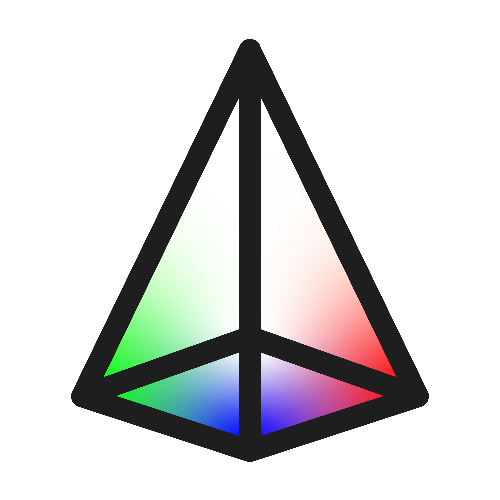

<div align="center">
  <table>
    <tr>
      <td align="center" width="33%">
        <br>
        <sub>Concept 1</sub>
      </td>
      <td align="center" width="33%">
        <br>
        <sub>Concept 2</sub>
      </td>
      <td align="center" width="33%">
        <br>
        <sub>Final Logo</sub>
      </td>
    </tr>
  </table>
</div>

# Prism —— 把混音折射成音轨

> Refract your mix into stems.

[English](README.md) | [简体中文](README_zh.md)

**Prism** 是一款基于 [HT-Demucs FT](https://github.com/facebookresearch/demucs)
四轨 ONNX 模型的批量音视频分轨工具，全程 CPU 运行，无需独立显卡。

---

## 特性

- 🎬 **批量处理** —— 把文件丢进 `input-video/` 就能跑
- 🧠 **四轨分离** —— drums / bass / other / vocals
- ⚡ **CPU 优化** —— 针对多核 CPU 调优
- 🌐 **双语界面** —— 自动识别中英文系统语言
- 📦 **免安装包** —— 无需 Python，解压即用
- 🧹 **绿色卸载器** —— 可选保留你的输入/输出数据

---

## 快速开始（普通用户）

1. 从 [**Releases**](https://github.com/Neus117/Prism/releases) 下载
   **`Prism-portable_vX.Y.Z.zip`**。
2. 解压到任意目录（例如 `D:\Prism`）。
3. 把要分离的视频或音频放入 `input-video` 文件夹。
4. 双击 `Prism.exe` 运行。
5. 分离结果（4 条音轨）会出现在 `output/<文件名>/` 内。

卸载时，双击同一目录下的 `uninstall.exe` 即可。卸载器会询问是否保留
`input-video` / `output` 里的用户数据。

> **无需安装 Python，也无需额外下载任何文件** —— `Prism-portable`
> 的 `_internal/` 目录里已经内嵌了 ONNX 模型与 FFmpeg。

### 支持格式

- **视频** —— `mp4` / `mov` / `mkv` / `avi` / `flv` / `wmv` / `webm` / `m4v`
- **音频** —— `mp3` / `wav` / `flac` / `m4a` / `aac` / `ogg` / `opus` / `wma` / `aiff`

### 关于同名文件

如果 `input-video` 里同时存在同名的音频和视频（例如 `song.mp4` 和
`song.mp3`），它们会**共用同一个输出目录** `output/song/`，只保留最后
处理的那 4 个 wav 文件。建议避免同名不同扩展名同时放入。

---

## 从源码运行

### 1. 环境要求

- **Python 3.10 或 3.11**（推荐 3.11）
- **FFmpeg** —— 一个 Windows 版 `ffmpeg.exe`（见第 3 步）
- **HT-Demucs FT ONNX 模型** —— 见第 3 步
- 任选其一：
  - **Anaconda / Miniconda**（新手推荐），或
  - **Python 自带的 `venv`**（轻量，无需额外安装）

### 2. 克隆仓库

```bash
git clone https://github.com/Neus117/Prism.git
cd Prism
```

### 3. 准备模型与 FFmpeg

ONNX 模型与 `ffmpeg.exe` **均未**提交到本仓库（合计数百 MB）。运行源码
之前，需要先把它们放到项目根目录：

```
Prism/
├── ffmpeg.exe
├── models/
│   ├── htdemucs_ft_drums_fp16weights.onnx
│   ├── htdemucs_ft_bass_fp16weights.onnx
│   ├── htdemucs_ft_other_fp16weights.onnx
│   └── htdemucs_ft_vocals_fp16weights.onnx
├── src/
└── ...
```

获取方式有**两种**：

**方案 A —— 从 `Prism-portable` 发布包中提取（最省事）**

1. 从 [**Releases**](https://github.com/Neus117/Prism/releases) 下载
   `Prism-portable_vX.Y.Z.zip`。
2. 解压到一个临时目录。
3. 把 `_internal/models/` 与 `_internal/ffmpeg.exe` 复制到源码项目的
   根目录，按上面的树状结构摆放即可。

**方案 B —— 从原始来源下载**

- **ONNX 模型** —— 由 **[StemSplit](https://stemsplit.io)** 发布在
  [huggingface.co/StemSplitio/htdemucs-ft-onnx](https://huggingface.co/StemSplitio/htdemucs-ft-onnx)。
  下载 4 个 `htdemucs_ft_*.onnx` 文件，保持文件名一致放入 `models/`。
- **FFmpeg** —— 从 [gyan.dev](https://www.gyan.dev/ffmpeg/builds/) 或
  [BtbN](https://github.com/BtbN/FFmpeg-Builds/releases) 下载任意
  Windows 版本，将 `ffmpeg.exe` 放到项目根目录。

### 4. 在**项目文件夹内**创建环境

强烈建议把虚拟环境建在项目目录**里面**，这样整个项目是自包含的：
想彻底清理时，直接删除项目文件夹即可。

#### 方案 A —— 使用 conda（推荐）

```bash
# 在 ./prism_env 处创建环境（项目文件夹内）
conda create -p ./prism_env python=3.11 -y

# 激活
conda activate ./prism_env
```

> **注意**：使用 `-p ./prism_env` 会把环境放在项目文件夹里。
> 请**不要**使用 `conda create -n prism` —— 那会把环境装到全局目录，
> 达不到“自包含”的目的。

#### 方案 B —— 使用 Python 自带的 venv

```bash
python -m venv .venv
```

按你使用的终端激活：

| 终端 | 命令 |
|---|---|
| PowerShell | `.\.venv\Scripts\Activate.ps1` |
| CMD | `.venv\Scripts\activate.bat` |
| Git Bash | `source .venv/Scripts/activate` |

> 如果 PowerShell 提示禁止运行脚本，先执行一次：
> `Set-ExecutionPolicy -ExecutionPolicy RemoteSigned -Scope CurrentUser`

### 5. 安装依赖

```bash
pip install -r requirements.txt
```

> 需要重建 `.exe` 的开发者 / 打包者，请额外安装：
> ```bash
> pip install -r requirements_build.txt
> ```

### 6. 运行

```bash
python src/batch_process.py
```

把媒体文件放入 `input-video/`，分离结果会出现在 `output/<文件名>/` 中。

---

## 重建 `.exe`（维护者）

如果你想自己重建免安装包：

```bash
pip install -r requirements_build.txt
.\build.bat
```

产物位于 `dist/Prism/`，结构如下：

```
dist/Prism/
├── Prism.exe
├── uninstall.exe
├── _internal/
│   ├── models/
│   ├── ffmpeg.exe
│   └── ...              # Python 运行时、DLL 等
├── input-video/
└── output/
```

将整个 `Prism/` 文件夹压缩为 `Prism-portable_vX.Y.Z.zip`，作为附件
上传到新的 GitHub Release 即可。

---

## 环境变量

| 变量 | 取值 | 作用 |
|---|---|---|
| `PRISM_LANG` | `zh`、`en` | 强制指定界面语言（默认自动识别） |

示例（PowerShell）：

```powershell
$env:PRISM_LANG = "en"
.\Prism.exe
```

---

## 项目结构

```
Prism/
├── src/
│   ├── batch_process.py        # 批处理主流程（ffmpeg → 分离 → 保存）
│   ├── bag_infer.py            # ONNX 推理引擎
│   └── paths.py                # 开发 / 冻结环境的路径解析
├── tools/
│   ├── make_icon.py            # 生成 assets/prism.ico
│   └── uninstall/
│       └── uninstall.py        # 绿色卸载器（源码）
├── assets/
│   └── prism.ico               # 应用图标
├── models/                     # ONNX 模型（未提交到仓库）
├── ffmpeg.exe                  # FFmpeg 可执行文件（未提交到仓库）
├── Prism.spec                  # 主程序 PyInstaller 配置
├── uninstall.spec              # 卸载器 PyInstaller 配置
├── version_info.txt            # 主程序 EXE 元数据
├── uninstall_version_info.txt  # 卸载器 EXE 元数据
├── requirements.txt            # 运行时依赖
├── requirements_build.txt      # 打包期依赖
└── build.bat                   # 一键打包脚本
```

---

## 许可证

本项目采用 **MIT License** 授权 —— 详见 [LICENSE](LICENSE)。

### 第三方声明

- **HT-Demucs FT ONNX 模型** —— © StemSplit
  （[stemsplit.io](https://stemsplit.io)）。具体条款请参考
  [原项目](https://huggingface.co/StemSplitio/htdemucs-ft-onnx)。
- **HT-Demucs / Demucs** —— Copyright (c) Meta Platforms, Inc.，MIT 许可。
- **FFmpeg** —— 独立项目，具体采用 LGPL 还是 GPL 取决于编译方式。
  如果你随 Prism 一起分发 `ffmpeg.exe`，请确保遵守你所分发版本的
  具体许可条款。参见 [ffmpeg.org/legal.html](https://ffmpeg.org/legal.html)。
- **ONNX Runtime** —— MIT 许可。
- **soundfile / libsndfile** —— BSD 3-Clause。

---

## 致谢

**首先特别感谢模型作者：**

- **[StemSplit](https://stemsplit.io)** —— Prism 所使用的 HT-Demucs FT
  **ONNX** 模型的原作者。原项目：
  [huggingface.co/StemSplitio/htdemucs-ft-onnx](https://huggingface.co/StemSplitio/htdemucs-ft-onnx)。

以及，感谢让这一切成为可能的以下项目：

- [Demucs](https://github.com/facebookresearch/demucs)（Meta AI Research）
- [ONNX Runtime](https://github.com/microsoft/onnxruntime)
- [soundfile](https://github.com/bastibe/python-soundfile)

---

## 贡献

欢迎提交 Issue 与 Pull Request。如果要做较大改动，建议先开一个
Issue 讨论你想改的内容。